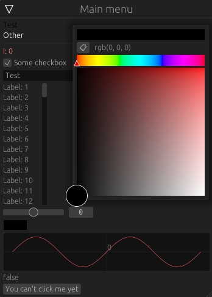

# egui-d3d11
D3D11 backend for egui library. Presumably for mods/cheats development.
Currently few features from egui are missing. WIP.

# Implemented features
- [x] Text rendering
- [x] Mesh rendering
- [x] Mouse input
- [x] Keyboard input
- [x] Scroll support
- [x] Scissor rects clipping
- [x] State storage
- [ ] Other image textures
- [ ] Drag & Drop support

# Example DLL
Example dll is contained in `example-wnd` folder. It uses either steam overlay hook or dxgi.

# **Contributions are welcome!**
Feel free to make an issue or fork the repository if you would like to contribute to the project.

# Example
